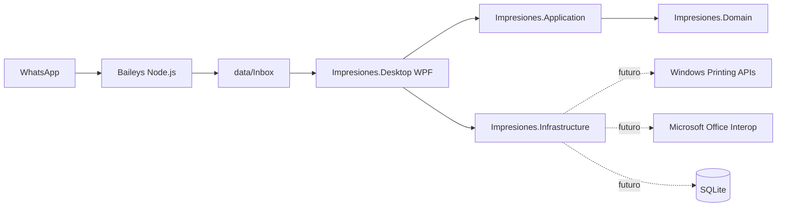

# Arquitectura

Este documento describe la arquitectura aprobada para Impresiones. El alcance funcional esta en [PROJECT_SCOPE.md](PROJECT_SCOPE.md), las decisiones consolidadas en [DECISIONS.md](DECISIONS.md) y el estado operativo en [PROJECT_STATUS.md](PROJECT_STATUS.md).

## Clean Architecture

La solucion .NET usa Clean Architecture. Las dependencias apuntan hacia `Impresiones.Domain`, `Impresiones.Domain` permanece independiente y `Impresiones.Desktop` actua como Composition Root.

## Capas

### Impresiones.Domain

Responsabilidades:

- Entidades.
- Enums.
- Value objects.
- Reglas e invariantes del dominio.

Restricciones:

- No depende de Application.
- No depende de Infrastructure.
- No depende de Desktop.
- No depende de WPF, SQLite, Office, Baileys ni APIs de impresion.

### Impresiones.Application

Responsabilidades:

- Casos de uso.
- Interfaces.
- Commands.
- Queries.
- DTO.
- Orquestacion de reglas del sistema.

Dependencia permitida:

- Domain.

### Impresiones.Infrastructure

Responsabilidades futuras:

- Archivos.
- SQLite.
- Windows Printing.
- Office Interop.
- Previews.
- Logs.
- Adaptadores del sistema operativo.

Dependencias permitidas:

- Application.
- Domain.

### Impresiones.Desktop

Responsabilidades:

- WPF.
- XAML.
- MVVM.
- Ventanas.
- Interaccion del usuario.
- Composition Root.

Dependencias permitidas:

- Application.
- Infrastructure.

## Proyectos de Pruebas

- `tests/Impresiones.Domain.Tests`: valida la capa Domain.
- `tests/Impresiones.Application.Tests`: valida la capa Application.
- `tests/Impresiones.Infrastructure.Tests`: valida la capa Infrastructure.

Las pruebas iniciales solo demuestran que xUnit descubre y ejecuta los proyectos.

## Baileys

Baileys es un proceso Node.js separado. No referencia la solucion .NET y se comunica con la aplicacion mediante el sistema de archivos. Su salida general es `data/Inbox`.

Baileys no debe evolucionar hasta convertirse en una segunda aplicacion de negocio. Su rol es recepcion, validacion, descarga, renombrado y guardado de archivos entrantes.

## Datos

- `Inbox`: archivos nuevos recibidos por Baileys.
- `Processing`: archivos actualmente en procesamiento.
- `Printed`: archivos que ya fueron impresos.
- `Discriminated`: archivos que el operador decidio no imprimir.
- `Previews`: vistas previas temporales.
- `Temp`: archivos temporales.
- `Logs`: logs futuros.
- `Database`: futura base SQLite local.

## Diagrama

El diagrama muestra limites y direccion general. Las integraciones marcadas como futuras no estan implementadas en el Commit 02.

## Reglas de Dependencia

- Las dependencias apuntan hacia Domain.
- Domain permanece independiente.
- Desktop actua como Composition Root.
- Las implementaciones externas pertenecen a Infrastructure.
- Baileys permanece fuera de la solucion .NET.
